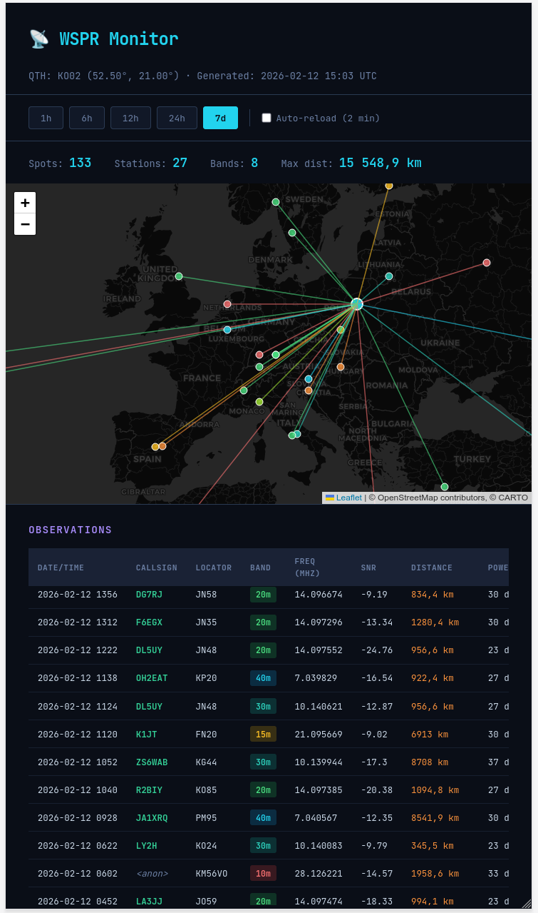
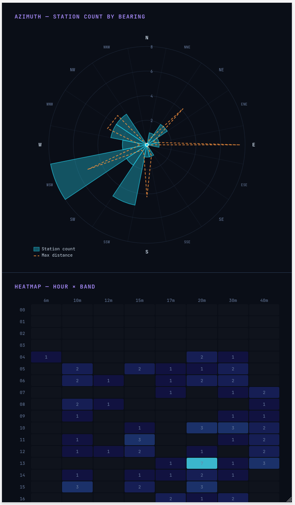

# WSPR Monitor

A set of *simple* tools for unattended Weak Signal Propagation Reporter [WSPR](https://en.wikipedia.org/wiki/WSPR_(amateur_radio_software)) spot collection and visualization using an RTL-SDR receiver and [rtlsdr_wsprd](https://github.com/filipsPL/rtlsdr-wsprd/) (modified). The report **is single, self-containing html file**, so no telegraf, grafana, influxdb etc. ;-) 

[](https://github.com/filipsPL/rtlsdr-wsprd-report/actions/workflows/test.yml)

## Components

**`wspr_hopper.sh`** — Band-hopping collector. Cycles `rtlsdr_wsprd` ([fork](https://github.com/filipsPL/rtlsdr-wsprd/)) through configured bands, writing spots to daily TSV log files (`wspr_logs/YYYY-mm-dd.tsv`). A symlink `spots-current.tsv` always points to today's file. Logs older than 30 days are automatically removed.

- **Day/Night band selection** — Two separate band lists are used depending on the UTC hour (default: day 06–18 UTC, night 18–06 UTC). Lower bands (160m–40m) are favored at night for better propagation, higher bands (40m–6m) during the day. The boundary hours and band lists are configurable at the top of the script.
- **WSPR-aligned timeout** — Instead of a fixed duration, listening time is dynamically calculated to align with the WSPR 2-minute transmission cycle. The script waits until the next even-minute UTC boundary, then listens for a configurable number of full cycles (`WSPR_CYCLES`, default: 2). This ensures every captured transmission is complete and minimizes idle time between bands.

**`wspr_analyzer.py`** — Report generator. Reads WSPR TSV logs, stores observations in a SQLite database (with deduplication), and produces a self-contained static HTML dashboard (~80-200 kb, depending on the number of observations) covering the last 7 days.


| screenshot 1                               | screenshot 2                                              |
| ------------------------------------------ | --------------------------------------------------------- |
|  |  |


The dashboard includes:

- Interactive map (Leaflet) showing paths from your QTH to each spotted station, color-coded by band
- Time window selector (1h / 6h / 12h / 24h / 7d)
- Summary stats: spot count, unique stations, bands active, max distance
- Hour vs Band activity heatmap
- Rose histogram showing the signal direction distribution
- Sortable observation table with calculated distance

## Requirements

- Python 3.10+, no external packages
- [rtlsdr_wsprd](https://github.com/filipsPL/rtlsdr-wsprd/) - please note 💡 this is the modified version that saves log to file (which is needed to be processed by the python script)
- RTL-SDR dongle for spot collection
- A web browser to view the report (uses Leaflet and CartoDB tiles via CDN)

## Usage

### Collecting spots - `wspr_hopper.sh`

Edit the configuration section at the top of `wspr_hopper.sh` (callsign, locator, bands, gain, cycles), then run:

```bash
chmod +x wspr_hopper.sh
./wspr_hopper.sh
```

It will loop indefinitely, automatically switching between day and night band sets. With the default `WSPR_CYCLES=2`, each band session lasts ~4 minutes (2 × 120s WSPR periods, plus alignment wait). Spots are appended to `wspr_logs/YYYY-mm-dd.tsv`. The report is regenerated after each band session.

Key configuration variables:

| Variable      | Default                          | Description                                                        |
| ------------- | -------------------------------- | ------------------------------------------------------------------ |
| `BANDS_DAY`   | `40m 30m 20m 17m 15m 12m 10m 6m` | Bands used during daytime (06–18 UTC)                              |
| `BANDS_NIGHT` | `160m 80m 60m 40m 30m`           | Bands used during nighttime (18–06 UTC)                            |
| `DAY_START`   | `6`                              | UTC hour when day begins                                           |
| `DAY_END`     | `18`                             | UTC hour when night begins                                         |
| `WSPR_CYCLES` | `2`                              | Number of full WSPR TX cycles per band                             |
| `MARGIN`      | `7`                              | Time needed to close the current session and start new. See below  |


Adjusting `MARGIN` variable. Use the default settings and observe for messages *Wait for time sync (start in XXX sec)*. If XXX is small (like 2 seconds or so) the `MARGIN` is ok. If it is 0, it is risky as we may miss the slot. If it is higher than, let say, 100 seconds, `MARGIN` is too small, so increase the value.


### Generating the report `wspr_analyzer.py`

(when used without `wspr_hopper.sh` or if you want your reports more frequently than every `wspr_hopper.sh` loop)

```bash
python3 wspr_analyzer.py samples/spots.tsv KO02 --db samples/wspr.db --output samples/wspr_report.html
```

| Argument   | Description                                         |
| ---------- | --------------------------------------------------- |
| `tsv_file` | Path to WSPR TSV log (positional, required)         |
| `locator`  | Your Maidenhead grid locator (positional, required) |
| `--db`     | SQLite database path (default: `wspr.db`)           |
| `--output` | Output HTML file (default: `wspr_report.html`)      |

Re-importing the same file is safe — duplicate observations are skipped.

To ingest all accumulated logs at once:

```bash
for f in wspr_logs/2026-*.tsv; do
    python3 wspr_analyzer.py "$f" KO02
done
```

